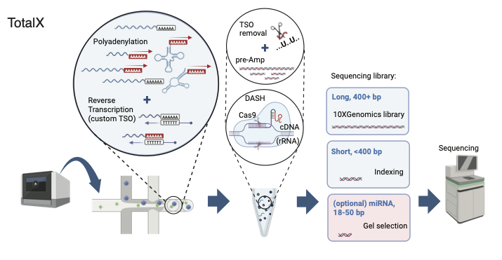

# TotalX: Scalable Single-cell Total RNA-seq on 10x Genomics Chromium platform

**Authors:** Alina Isakova et al.

## Overview

TotalX is a robust, scalable framework for single-cell total RNA profiling that enables detection of both polyadenylated and non-polyadenylated transcripts—including miRNAs, lncRNAs, tRNAs, snoRNAs, snRNAs, and histone RNAs—at high throughput and with minimal protocol changes to the standard 10x Genomics platform.

> **Figure 1A.** Overview of the TotalX protocol:



*TotalX workflow: enzymatic polyadenylation, reverse transcription with a custom TSO, Cas9-based rRNA depletion, separation of long/short cDNA, optional miRNA enrichment, and high-throughput sequencing. See manuscript for details.*

## Method Description

TotalX adapts the Smart-seq-total principles to droplet-based 10x Genomics 3′ chemistry, using a custom template-switching oligo (dU-TSO) and uracil-DNA glycosylase (UDG) for cDNA processing, with Cas9-mediated rRNA depletion (DASH).  
- Both long (>400 bp) and short (<400 bp) RNA fragments are indexed and sequenced in parallel, with optional miRNA enrichment.
- Used with a standard Cell Ranger pipeline.
- Recovers diverse RNA biotypes at single-cell resolution.

---


## Data processing and alignment workflow:

1. **Demultiplex raw sequencing data**:

   ```bash
   cellranger mkfastq --id=<run_id> --run=<path_to_run>
   ```

2. **Trim reads**:

   ```bash
   cutadapt -u 6 -a "AAAAAAAAAA;min_overlap=10" -m 18 -o ${TRIM_R2} -p ${TRIM_R1} "${R2_lane_file}" "${R1_lane_file}"
   ```

3. **Dual-pass alignment strategy**:

   * **Long RNA reference**: includes protein-coding genes, lncRNAs, miRNAs, snRNAs, snoRNAs, tRNAs, immunoglobulin/T-cell receptor genes, and viral genomes. See [scripts/annotation.sh](annotation.sh) for details.
   * **Short RNA reference**: includes miRNAs, snoRNAs, and scaRNAs for accurate mapping. See [annotation\_smallRNA.sh](scripts/annotation_smallRNA.sh) for details.
     
4. **Run Cell Ranger count**:

   * Modify STAR parameters in `parameters.toml` file:

     ```
     star_parameters = "--outFilterMismatchNoverLmax=0.05 --outFilterMatchNmin=18 --outFilterScoreMinOverLread=0 --outFilterMatchNminOverLread=0"
     ```
   * Execute Cell Ranger count:

     ```bash
     cellranger count --id=<sample_id> --transcriptome=<reference> --fastqs=<fastq_dir> --sample=<sample_name> --include-introns=true
     ```

5. **Merge final matrices**:

   * Merge count matrices, resolve overlaps, and ensure accurate UMI counting: See [TotalX.preprocess.ipynb](TotalX.preprocess.ipynb) TotalX.preprocess.ipynb for details 


---

## Citation

*(Add your citation info)*

---

## More Information

For full details, see the [preprint/manuscript](link), or contact isakova@stanford.edu.


