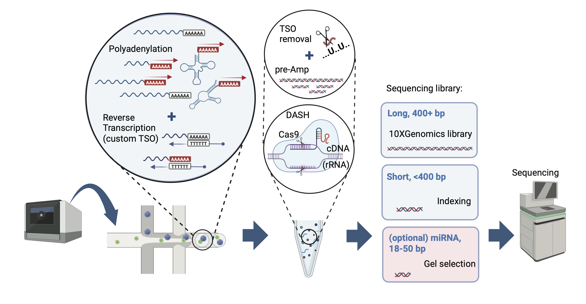

# TotalX: Scalable Single-cell Total RNA-seq on 10x Genomics Chromium platform

**Authors:** Alina Isakova et al.

## Overview

TotalX is a robust, scalable framework for single-cell total RNA profiling that enables detection of both polyadenylated and non-polyadenylated transcripts—including miRNAs, lncRNAs, tRNAs, snoRNAs, snRNAs, and histone RNAs—at high throughput and with minimal protocol changes to the standard 10x Genomics platform.

> **Figure 1A.** Overview of the TotalX protocol:

*Figure 1 shows the workflow: enzymatic polyadenylation, reverse transcription with a custom TSO, Cas9-based rRNA depletion, separation of long/short cDNA, optional miRNA enrichment, and high-throughput sequencing. See manuscript for details.*

## Method Description

TotalX adapts the Smart-seq-total principles to droplet-based 10x Genomics 3′ chemistry, using a custom template-switching oligo (dU-TSO) and uracil-DNA glycosylase (UDG) for cDNA processing, with Cas9-mediated rRNA depletion (DASH).  
- Both long (>400 bp) and short (<400 bp) RNA fragments are indexed and sequenced in parallel, with optional miRNA enrichment.
- Used with a standard Cell Ranger pipeline.
- Recovers diverse RNA biotypes at single-cell resolution.

---

## How to Use

*(Add installation, code, or links here)*

---

## Citation

*(Add your citation info)*

---

## More Information

For full details, see the [preprint/manuscript](link), or contact isakova@satnford.edu.

